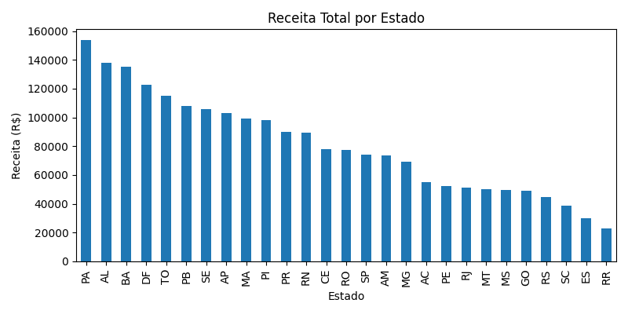
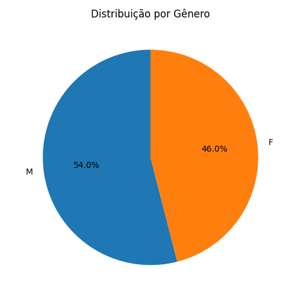
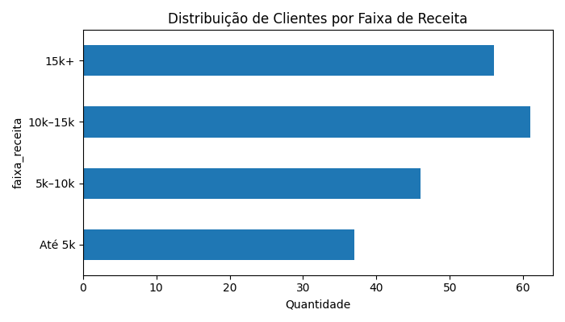

# 🧮 Simulador de Banco de Dados de Clientes  
### Customer Database Simulator (Python)

---

## 🇧🇷 Sobre o Projeto | 🇺🇸 About the Project

🇧🇷 Este projeto simula uma base de dados corporativa de clientes usando **Python**, **JSON**, **pandas** e **matplotlib**.  
Ele gera automaticamente uma base de 200 clientes fictícios, permitindo testar **análises de dados**, **visualizações gráficas** e **processos ETL** locais.

🇺🇸 This project simulates a corporate customer database using **Python**, **JSON**, **pandas**, and **matplotlib**.  
It automatically generates a synthetic dataset with 200 customers — ideal for experimenting with **data analysis**, **visualizations**, and **ETL flows**.

📦 **Repositório:**  
👉 [github.com/GeovaneParedes/simulador_clientes](https://github.com/GeovaneParedes/simulador_clientes)

---

## 🗂️ Estrutura | Structure

/empresa_dados/
│
├── clientes.json # Base simulada | Simulated customer data
├── analise_cliente.py # Análise com pandas + matplotlib | Analysis with pandas + matplotlib
└── utils/
└── gerador_clientes.py # Geração automática | Random data generator

---

## 🧩 Funcionalidades | Features

| 🇧🇷 Em Português | 🇺🇸 In English |
|:-----------------|:---------------|
| Gera clientes falsos realistas com **Faker** | Generates realistic fake customers with **Faker** |
| Calcula estatísticas (idade média, receita etc.) | Calculates KPIs (average age, revenue, etc.) |
| Cria gráficos automáticos em `/graficos/` | Automatically saves charts in `/graficos/` |
| Análises com **pandas** e **matplotlib** | Analysis with **pandas** and **matplotlib** |
| Código limpo e modular | Clean, modular and readable code |

---

## 📊 Exemplo de Saída | Example Output

📊 RESUMO GERAL
Total de clientes: 200
Ativos: 149 (74.5%)
Média de idade: 43.2
Receita total: R$ 2,174,780.49
Média por cliente: R$ 10,873.90
Clientes VIP (> R$15.000): 56

---

## 📈 Visualizações | Visualizations

### 🇧🇷 Clientes por Estado | 🇺🇸 Customers by State

---

### 🇧🇷 Receita Total por Estado | 🇺🇸 Total Revenue by State

---

### 🇧🇷 Distribuição por Gênero | 🇺🇸 Gender Distribution

---

### 🇧🇷 Faixas de Receita | 🇺🇸 Revenue Range Distribution

---

## ⚙️ Instalação | Installation

💡 Caso use Linux e queira gráficos interativos:
sudo apt install python3-tk

💡 On Linux, for interactive chart display:
sudo apt install python3-tk

python -m venv .venv
source .venv/bin/activate   # Linux / Mac
.venv\Scripts\activate      # Windows

pip install -r requirements.txt

🚀 Execução | Usage
🇧🇷 Gerar base de dados | 🇺🇸 Generate dataset

python utils/gerador_clientes.py

🇧🇷 Rodar análise e gerar gráficos | 🇺🇸 Run analysis and generate charts

python analise_cliente.py

Os gráficos serão salvos automaticamente em /graficos/
Charts will be saved automatically in /graficos/

🧠 Próximos Passos | Next Steps

| 🇧🇷                                              | 🇺🇸                                                 |
| :---------------------------------------------- | :--------------------------------------------------- |
| 🧩 Criar dashboard interativo com **Streamlit** | 🧩 Build an interactive dashboard with **Streamlit** |
| 🗄️ Integrar com **SQLite / PostgreSQL**         | 🗄️ Integrate with **SQLite / PostgreSQL**           |
| 📤 Exportar relatórios em **CSV / Excel**       | 📤 Export reports to **CSV / Excel**                 |
| 🔁 Automatizar pipeline ETL simulado            | 🔁 Automate a simulated ETL pipeline                 |

🧮 Tecnologias | Technologies

| Stack      | Versão | Uso / Use                             |
| :--------- | :----- | :------------------------------------ |
| Python     | ≥ 3.11 | Linguagem principal / Main language   |
| Faker      | 30.0.0 | Geração de dados falsos / Fake data   |
| pandas     | 2.2.3  | Análise de dados / Data analysis      |
| matplotlib | 3.9.2  | Visualização de dados / Visualization |

👨‍💻 Autor | Author

@DevGege (Geovane Paredes)
💼 Programador Sênior • Software & DevOps

🇧🇷 “Código limpo é mais do que estética — é uma forma de pensar.”
🇺🇸 “Clean code is more than aesthetics — it’s a mindset.”

🧾 Licença | License

Distribuído sob licença MIT — uso livre para fins educacionais e experimentais.
Sinta-se à vontade para forkar, evoluir e criar novas análises a partir deste projeto.
